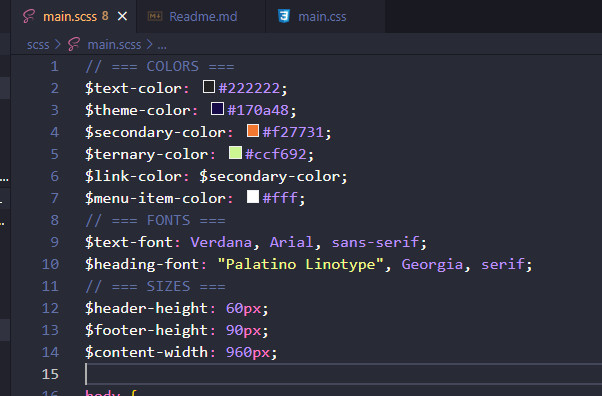

# SASS learning

sass --watch scss/main.scss:css/main.css

### Cài đặt extention hoặc dùng câu lệnh trên để lắng nghe và complie

---

## Biến:

Biến trong file scss được sử dụng bằng $ và có thể gọi bất cứ đâu trong code

Ví dụ :

````scss
   $text-color: #222222;
   $header-height: 60px;
   ```
````

---

## Cách đặt các biến sao cho phù hợp



---

## Import các file khác

Sau khi tạo thêm 1 file có tên là varriable.scss ta thêm dấu \_ đằng trước để compiler nó không render thêm file css

Import như sau:

```scss
@import "varriable";
```

vậy nên giờ ta có thể tách cách file riêng biệt và khi nào cần dùng tới ta chỉ cần import file vào là được rồi.

---

## Sử dụng mixin như một block code cho css

Tạo ra một hàm mà khi gọi tới ta sẽ dùng `@include tên_hàm `. Ví dụ :

```scss
@mixin success {
  background-color: green;
  color: #fff;
  border: none;
}

Khi sử dụng mixin vào ta dùng như sau .btn-success {
  @include success();
  padding: 8px 12px;
}
```

### Đặc biệt khi sử dụng `@include success();` ở ngoài thì tất cả các thuộc tính trong trang đều chịu thay đổi theo nó

## Sử dụng mixin truyền tham số vào

```scss
Khi ta thêm tham số truyền vào thì sẽ như vậy @mixin rounded($radius) {
  border-radius: $radius;
}

@mixin box($radius, $border) {
  @include rounded($radius);
  border: $border;
}
```

còn ở phần khai báo chúng ta bắt buộ phải có thêm dấu () ở phần khai báo mixin, như sau:

```scss
#header {
  @include box(6px, 1px solid #000);
  height: $header-height;
  background-color: $theme-color;
  #main-menu {
    li {
      display: inline;
    }
    a {
      color: $menu-item-color;
    }
  }

  #logo {
  }
}
```

có cách nữa nhưng ít người sử dụng nhưng nó tường minh hơn một chút xí :v

```scss
#header {
  @include box($radius: 6px, $border: 1px solid #000);
  height: $header-height;
  background-color: $theme-color;
  #main-menu {
    li {
      display: inline;
    }
    a {
      color: $menu-item-color;
    }
  }

  #logo {
  }
}
```

còn khi muốn chèn thêm một giá trị mặc định khi người dùng không nhập vào giá trị như sau:

```scss
@mixin box($radius: 5px, $border: 1px solid #333) {
  @include rounded($radius);
  border: $border;
}
#header {
  @include box(); // mặc định sẽ là ($radius : 5px,$border : 1px solid #333)
  height: $header-height;
  background-color: $theme-color;
}
```

Mixin nhiều quá rồi nhỉ, nhưng vẫn còn một cái nữa là @content

```scss
@mixin apply-to-ie-6 {
  * html {
    @content;
  }
}
```

khi khai báo một cái mixin như này nghĩa là mình chưa chắc chắn mình sẽ dùng tới nó vào thời điểm hiện tại mình sẽ gọi tới nó và truyền tham số vào sau

```scss
@include apply-to-ie-6 {
  body {
    font-size: 200%;
    color: yellow;
  }
}
```

đoạn mã css nhận được là :

```css
* html body {
  font-size: 200%;
  color: yellow;
}
```

## Những cách khác nhau để import trong Sass

```scss
@import url("varriable");
@import "https://";
@import "filename.scss";
@import "style-screen" screen;
@import "partials/varriable", "partials/mixins";
```

### Import font

```scss
@mixin google-font($font) {
  $font: unquote($font);
  @import url(https://fonts.googleapis.com/css?family=#{$font});
}

main.scss

@include google-font(Lato);
@include google-font(Fira+Sans);

```

---

## Tính toán

thử bằng command `sass --interactive ` có thể sử dụng ngay trong dòng:

3px + 4px > 7px

4px - 4px > 0px

2px * 2px > 4px*px

$temp: 2px * 2px > 4px*px

$temp / 2px > 2px

1in - 10px > 0.8958333333in

100px - 1in > (100px - 1in)

2em - 8px > SyntaxError

8px/4px > 8px/4px

(8px/4px) > 2

$v:8px

$v/4px > 2

---

## Màu

Mở command line ra cho chắc

`sass -i `

sắp xoá r

#333 + #777 > #aaaaaa

#090807 - #030201 > #060606

#123456 \* 2 > #2468ac

#888 / # 080402 > SyntaxError

#888 / #080402 > #112244

---

## Function:

các function có sẵn như :

lighten($color, $amount)

opacify($color, $amount)

fade-in($color, $amount)

...

tham khảo thêm ở link : https://sass-lang.com/documentation/modules

---

## Kế thừa:

Sử dụng từ khoá @extend để kế thừa lại giá trị của class

```scss
.btn-success {
  @include success();
  padding: 8px 12px;
}
.btn-error {
  @extend .btn-success;
  @include rounded-btn;
  width: 50px;
  height: 50px;
}
```

### Còn nếu không muốn nó chung style bên css thì chúng ta dùng như sau :

Thêm dấu % trước class cha:

```scss
%highlight {
  font-style: italic;
}

.sub-title {
  @extend %highlight;
  font-size: em(20px);
}
```

---

## Toán tử:

vẫn dùng `sass -i`

3>4 => false

"sass" == "sass" => true

"sass" > "obj" => SyntaxError

#333 = #333 => true

---

## Câu lệnh điều kiện

```scss
// === COLORS ===
$body-background-color: #fff;
$text-color: #222222;
$theme-color: #170a48;
$secondary-color: #f27731;
$ternary-color: #ccf692;
$link-color: $secondary-color;
$menu-item-color: #fff;

@if $theme == Dark {
  $body-background-color: #22222a;
  $text-color: #fff;
  $theme-color: #43434a;
  $secondary-color: #c24721;
  $ternary-color: #698932;
  $link-color: $secondary-color;
  $menu-item-color: #fff;
} @else if $theme == Light {
  $body-background-color: #fff;
  $text-color: #000;
  $theme-color: #372a27;
  $secondary-color: #d26741;
  $ternary-color: #b9da63;
  $link-color: $secondary-color;
  $menu-item-color: #fff;
}
```

bên trên ta dùng như sau:

```scss
$theme: Default;
```

---

## Vòng lặp:

ở đây chúng ta thử kết hợp `for` và `if`

```scss
@for $i from 1 through 12 {
  @if $i % 2 == 0 {
    .col-#{$i} {
      width: $i * 2rem;
    }
  }
}
```

Kết quả nhận được ở file `main.css` như sau:

```scss
.col-2 {
  width: 4rem;
}

.col-4 {
  width: 8rem;
}

.col-6 {
  width: 12rem;
}

.col-8 {
  width: 16rem;
}

.col-10 {
  width: 20rem;
}

.col-12 {
  width: 24rem;
}
```

như vậy đỡ công viết tay rất nhiều và còn thêm cả tính toán

---

## Vòng lặp each:

```scss
$icons: icon-facebook, icon-twitter, icon-youtube, icon-zalo, icon-skype;
@each $icon in $icons {
  .#{$icon}-img {
    background-image: url("/img/icons/#{$icon}");
  }
}
```

kết quả nhận được là :

```scss
.icon-facebook-img {
  background-image: url("/img/icons/icon-facebook");
}

.icon-twitter-img {
  background-image: url("/img/icons/icon-twitter");
}

.icon-youtube-img {
  background-image: url("/img/icons/icon-youtube");
}

.icon-zalo-img {
  background-image: url("/img/icons/icon-zalo");
}

.icon-skype-img {
  background-image: url("/img/icons/icon-skype");
}
```
---

## Vòng lặp while:

```scss
$grid: 12;
@while $grid >=2 {
  .grid-#{$grid} {
    width: $grid * 10%;
  }
  $grid: $grid - 2;
}
```

```scss
.grid-12 {
  width: 120%;
}

.grid-10 {
  width: 100%;
}

.grid-8 {
  width: 80%;
}

.grid-6 {
  width: 60%;
}

.grid-4 {
  width: 40%;
}

.grid-2 {
  width: 20%;
}
```